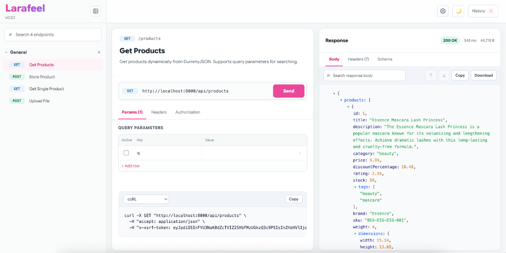

# Larafeel 🚀

[](https://packagist.org/packages/yudafhd/larafeel)
[](https://packagist.org/packages/yudafhd/larafeel)
[](LICENSE)

**Larafeel** is a Laravel package designed to deliver a modern, interactive, and responsive API documentation dashboard. By combining **Scramble**'s capability to auto-generate OpenAPI documentation (without requiring manual PHPDoc annotations) with a feature-rich, **React-based API client** UI, Larafeel brings Postman-like capabilities directly to your browser.

Easily access your documentation page via the `/docs/larafeel` route!



---

## ✨ Key Features

- **⚡ Auto-Documentation (Scramble Integration):** Automatically detects your Laravel API routes, request rules, and responses. No more tedious PHPDoc writing.
- **💻 Interactive API Client (Try It):** Test your endpoints directly from the dashboard. Supports query parameters, path variables, request bodies, custom headers, and file uploads (`multipart/form-data`).
- **🔑 Persistent Authorization:** Support for Bearer Token, API Key (via Header or Query), and Basic Auth. Your credentials are saved securely in `localStorage` so you don't have to re-enter them constantly.
- **📜 Request History:** Stores your API request history locally in the sidebar, allowing you to replay past requests with a single click.
- **🛠️ Deep Schema Explorer:** Interactively explore your JSON request and response models with an intuitive node-tree schema viewer.
- **🎨 Code Snippet Generator:** Instantly generate integration snippets for popular languages and tools:
  - `cURL`
  - `JavaScript` (Fetch API)
  - `Python` (Requests)
  - `PHP` (Guzzle)
- **🌗 Theme Switcher:** Fully supports `Light`, `Dark`, or auto-syncing with `System` appearance.
- **🔒 Secure by Default:** Documentation is automatically active in `local` and `development` environments. For production, restrict access using a standard Laravel Gate (`viewApiDocs`).

---

## 🚀 Installation

Install Larafeel in your Laravel project with these simple steps:

### 1. Install via Composer
Add the package to your project:
```bash
composer require yudafhd/larafeel
```

### 2. Publish Configuration
Publish the `larafeel.php` configuration file to customize the default settings:
```bash
php artisan vendor:publish --tag=larafeel-config
```

### 3. Publish Frontend Assets
Publish the compiled JavaScript and CSS assets required for the React dashboard:
```bash
php artisan vendor:publish --tag=laravel-assets
```

Once installed, navigate to:
```
http://localhost:8000/docs/larafeel
```

---

## ⚙️ Configuration (`config/larafeel.php`)

After publishing the configuration, you can adjust it in `config/larafeel.php`. Key options include:

| Option | Default | Description |
|------|---------|-------------|
| `api_path` | `'api'` | The route prefix for the APIs you wish to document. |
| `export_path` | `'api.json'` | The path where the generated OpenAPI JSON specification is exposed (e.g., `/docs/api.json`). |
| `ui.title` | `'Larafeel'` | The title displayed on the documentation tab. |
| `ui.theme` | `'system'` | The default theme (`light`, `dark`, or `system`). |
| `ui.layout` | `'responsive'` | The layout style (`sidebar`, `responsive`, or `stacked`). |
| `ui.hide_try_it`| `false` | Set to `true` to hide the API client "Try It" panel. |

---

## 🔒 Access Control & Security

By default, Larafeel permits access automatically in **`local`** and **`development`** environments.

For production, define a Laravel Gate named `viewApiDocs` in your `App\Providers\AppServiceProvider.php` (Laravel 11+) or `AuthServiceProvider.php` (Laravel 10) to control access to the API documentation:

```php
use Illuminate\Support\Facades\Gate;

/**
 * Bootstrap any application services.
 */
public function boot(): void
{
    // Restrict access to authorized administrator users
    Gate::define('viewApiDocs', function ($user = null) {
        return optional($user)->is_admin;
    });
}
```

---

## 🛠️ Frontend Assets Development

If you'd like to customize or contribute to the React interface of the Larafeel dashboard, you can build the assets locally:

1. **Install Dependencies:**
   ```bash
   pnpm install
   # or with npm:
   npm install
   ```

2. **Run Production Build:**
   ```bash
   npm run build
   ```
   *This compiles the React entry point and CSS into `resources/dist` using Vite.*

3. **Run Development Watcher:**
   ```bash
   npm run watch
   ```

4. **Update Host Project Assets:**
   Publish the updated assets to your host Laravel project's public folder:
   ```bash
   php artisan vendor:publish --tag=laravel-assets --force
   ```

---

## 📄 License

Larafeel is open-source software licensed under the **[MIT License](LICENSE)**.

---

<p align="center">
  Made with ❤️ by <a href="https://github.com/yudafhd">Yuda</a>
</p>
